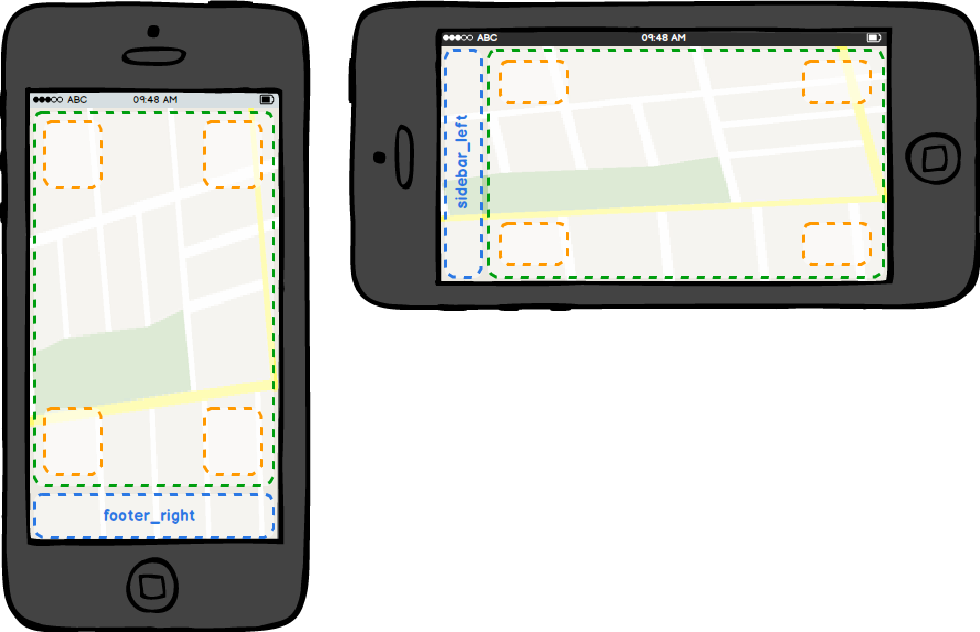

# template-seasons

The Seasons Template bundle provides the map.apps default layout template with responsive capabilities and predefined anchorpoints.
These anchor points can be used to configure the position and behavior of windows and widgets.
The Seasons Template is best used along with the "everlasting", "winter", "summer", "autumn", "spring", or any other map.apps theme that is based on the "winter"-theme.

## Usage

To enable the Seasons Template, add it to the `allowedBundles` section within the `app.json` file and tell the `templates` bundle to select it. Example:
```json
"templates": {
    "TemplateModel": {
        "_selectedTemplate": "seasons"
    }
}
```

### How to attach widgets to predefined insertion points

Each sub-layout (`desktop`, `tablet_landscape`, `tablet_portrait`, `mobile_landscape`, `mobile_portrait`) provided by the Seasons template has the following generic attach-points.
You can place widgets at these attach-points by setting the value of the `attachTo` property to the name of the target attach-point.

|Attach-point name|desktop|tablet|mobile|Description
|-----------------|-------|------|------|---
|header_center    |Yes    |Yes   |Nos   |Center part of application header
|header_right     |Yes    |Yes   |No    |Right-hand part of application header
|map_main         |Yes    |Yes   |Yes   |Over map container. Elements inside this attach-point have to be placed absolute with CSS
|map_topleft      |Yes    |Yes   |Yes   |Preconfigured attach-point in the map's top left corner
|map_topright     |Yes    |Yes   |Yes   |Preconfigured attach-point in the map's top right corner
|map_bottomright  |Yes    |Yes   |Yes   |Preconfigured attach-point in the map's bottom right corner
|map_bottomleft   |Yes    |Yes   |Yes   |Preconfigured attach-point in the map's bottom left corner
|footer_left      |Yes    |Yes   |No    |Left-hand part of application footer
|footer_right     |Yes    |Yes   |Yes   |Right-hand part of application footer
|sidebar_left     |No     |No    |Yes   |The sidebar on the left hand side
|template_root    |Yes    |Yes   |Yes   |Root of the template (for example for overlaying the whole application)


