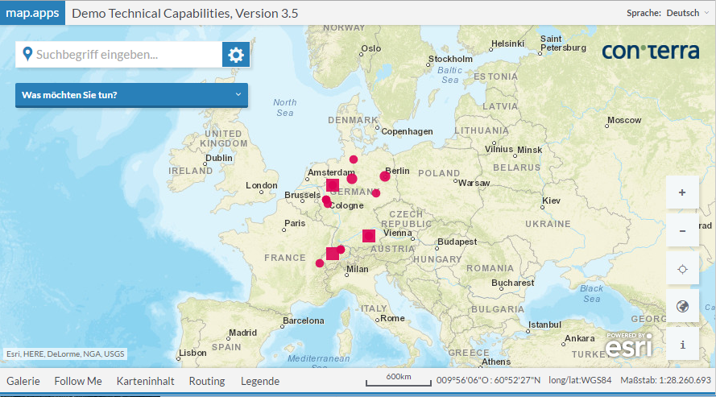

# theme-happy

 
Provides a color scheme for map.apps and its dijit widgets.
 
## Usage
 
No configuration is needed. Default values are applied.

Check the [themes bundle](#bundle=themes@) documentation to see how to preselect a theme for an app.
 
## Use Cases

### How to build an own theme based on Autumn Theme
 
To build an own theme based on Autumn Theme copy the file `themeSettings.less` from `bundles/layout/theme-autumn/styles/` to your own theme folder.